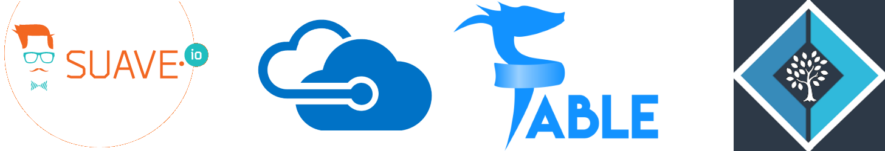
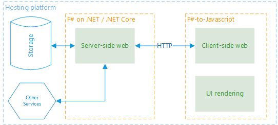

## An end-to-end, functional-first stack for cloud-ready web development that emphasises type-safe programming.

### What is SAFE?
SAFE is a technology stack that brings together several technologies into a single, coherent stack for type-safe, flexible, web-enabled applications that are written wherever possible in F#, thus allowing you to reuse your existing skill set as much as possible.

The default stack consists of the following core components:

#### Suave IO
> Suave is a lightweight, non-blocking web server. The non-blocking I/O model is efficient and suitable for building fast, scalable network applications. In fact, Suave is written in a completely non-blocking fashion throughout. Suave runs on Linux, OS X and Windows flawlessly.

#### Azure
> Microsoft Azure is a growing collection of integrated cloud services that developers and IT professionals use to build, deploy, and manage applications through our global network of datacenters. With Azure, you get the freedom to build and deploy wherever you want, using the tools, applications, and frameworks of your choice.

#### Fable
> Fable brings all the power of F# to the JavaScript ecosystem. Enjoy advanced language features like static typing with type inference, exhaustive pattern matching, immutability by default, structural equality or units of measure, and let the compiler catch the bugs for you before they ever get into runtime.

#### Elmish
> Elmish implements core abstractions that can be used to build Fable applications following the “model view update” style of architecture, as made famous by Elm.

Together, these components provide the capability to write entire applications, from data access through to client-side UIs entirely in F# in a performant, type-safe manner.

### Why SAFE?
The SAFE stack provides developers who are already enjoying the benefits with functional programming, and in particular F#, with a flexible stack that provides complete end-to-end solutions for your web-enabled applications using popular and widely-used technologies.

For those developers who are not familiar with functional programming, or are .NET developers who have not taken the leap to F#, SAFE provides a coherent stack that will get you up and running as quickly as possible whilst leaving you safe in the knowledge that there's a community out there that can support you whilst you upskill.

### A flexible stack to suit your needs
Whilst the SAFE stacks recommends a number of specific technologies for you to use, it does not lock you in to any of them. Indeed, the goal of the SAFE stack is simply to provide a basic template of core technologies which take advantage of the benefits that F# provides as widely as possible within your stack.

#### A Pluggable Stack

Here's an example system architecture that could make use of the SAFE stack.

* **Hosting Platform** - provides the hosting environment for all services and data.
* **Storage** - some standard data storage mechanism
* **Other services** - includes messaging, logging or any other PAAS offered by the hosting platform.
* **Server-side web** - the application servicing HTTP requests, favouring a functional-first approach.
* **Client-side web** - application logic written in F# but cross-compiled into Javascript.
* **UI rendering** - the application framework that handles UI interaction.

A typical SAFE implementation *might* look like this. However, as you can see, there are multiple alternatives that can be employed to build a stack that adheres to the principles of SAFE but uses alternative technologies or tools where appropriate.

| | "Pure" SAFE | "DIY" Safe |
|-|-|-|
| Hosting Platform | Microsoft Azure | AWS, GCP |
| Storage | SQL Azure, Azure Storage, Document DB | Dynamo DB etc. |
| Other Services | Service Bus, App Insights, Event Hub | SQS etc. |
| Server-side | Suave | Giraffe, WebSharper, Freya |
| Client-side | Fable | WebSharper |
| UI Rendering | Elmish | HTML + JQuery, AngularJS etc. |

#### Retrofit to your existing stack
Since SAFE doesn't force you to write your entire stack with it, you can easily work with an existing stack and port parts of your application as needed. Working with an external team that manage your client-side code? No problem - just use Suave and Azure for your back-end services. Already using ASP .NET Web API for your server-side components? That's fine - F# through Fable boils down to easy-to-read, high-quality Javascript! Want to still use raw SQL rather than an ORM to generate it for you? F# has you covered, with type providers that still give you type safety at the SQL level.

### How do I get started?
There's an excellent sample [SAFE Bookstore](https://t.co/OVJkvNHW9j) that you can use as a basic template; it uses Suave and Fable to create a reactive application running in the browser. Over time, we'll be adding more fully featured applications that can also run on Azure as well as using other technologies that fit within the aims of SAFE.

### Who can I turn to for guidance?
There are a number of expert practitions who support and are available to help you get the best out of the SAFE stack. We'll be adding more over time to this list - if you want to be added here, plus let us know!

#### Compositional IT
[Compositional IT](https://compositional-it.com) are experts in designing functional-first, cloud-ready systems, offering consultancy and support, training and development. Run by an F# MVP and well-known member of the .NET community, they are dedicated to raising awareness of the benefits of both functional programming and harnessing the power of the cloud to deliver high-quality, low-cost solutions.

#### Lambda Factory
[Lambda Factory](http://lambdafactory.io) is a consulting company specializing in designing and building complex systems using Functional Programming languages such as F#, Elm and Elixir. It also offers help with introducing functional programming and open source driven development to the organization, as well as trainings, workshops and mentoring. Founded by open source contributor and well-known member of F# Community, Lambda Factory has been committed to supporting F# Community and helping it grow.

#### The F# Community
The SAFE stack was written largely by the community as open source projects, such as Suave, Fable, Elmish (as well as the alternative elements within the stack). All those teams are always happy to contribute and help out.

You can also reach out to the SAFE team on [@safe_stack](https://twitter.com/safe_stack) or on the regular F# channels on Slack: either the [official F# Foundation](https://fsharp.slack.com/) or on the [Functional Programming Slack](https://functionalprogramming.slack.com). We'll be expanding this over time.

